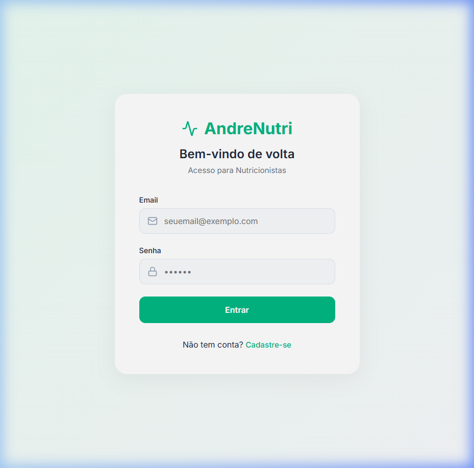
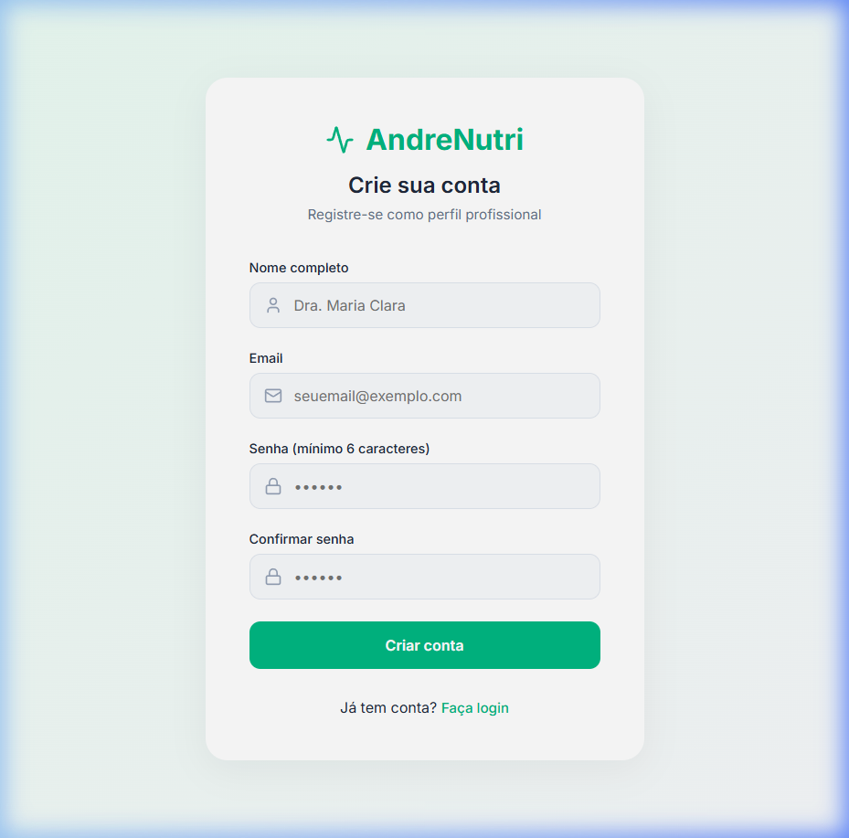

# 🥗 Sistema Nutricionista

Um sistema moderno e intuitivo desenvolvido para auxiliar nutricionistas na gestão de seus pacientes, planos alimentares e acompanhamento de progresso.

## 🚀 Funcionalidades Principais

- **🔐 Autenticação Segura**: Sistema de login e registro integrado com Supabase.
- **📊 Dashboard Estratégico**: Visão geral de pacientes, consultas e métricas rápidas com gráficos interativos.
- **👥 Gestão de Pacientes**: Cadastro completo incluindo:
  - Dados Pessoais e Contato.
  - **Anamnese Detalhada**: Histórico médico, estilo de vida e objetivos.
  - **Antropometria**: Registro de peso, altura, circunferências e dobras cutâneas.
  - **Preferências Alimentares**: Registro de gostos, aversões e rotina alimentar.
- **📱 Design Responsivo**: Interface premium otimizada para desktops e tablets.
- **🎨 Experiência do Usuário**: Navegação fluida com Sidebar e Layout estruturado.

## 📸 Screenshots

| Login | Cadastro |
|-------|----------|
|  |  |

## 🛠️ Tecnologias Utilizadas

- **Frontend**: [React 19](https://react.dev/) + [Vite](https://vitejs.dev/)
- **Backend/Banco de Dados**: [Supabase](https://supabase.com/) (PostgreSQL + Auth)
- **Roteamento**: [React Router DOM](https://reactrouter.com/)
- **Gráficos**: [Recharts](https://recharts.org/)
- **Ícones**: [Lucide React](https://lucide.dev/)
- **Estilização**: CSS Vanilla (Design System Proprietário)

## 📁 Estrutura do Projeto

```text
src/
├── components/   # Componentes reutilizáveis (Sidebar, Layout, etc)
├── context/      # Gerenciamento de estado global (Auth)
├── lib/          # Configurações de bibliotecas externas (Supabase client)
├── pages/        # Telas principais da aplicação
├── assets/       # Imagens e recursos estáticos
└── index.css     # Sistema de design e estilos globais
```

## ⚙️ Configuração e Instalação

### Pré-requisitos
- [Node.js](https://nodejs.org/) (versão 18 ou superior)
- Conta no [Supabase](https://supabase.com/)

### Passo a Passo

1.  **Clonar o repositório**
    ```bash
    git clone https://github.com/seu-usuario/sistema-nutricionista.git
    cd sistema-nutricionista
    ```

2.  **Instalar dependências**
    ```bash
    npm install
    ```

3.  **Configurar Variáveis de Ambiente**
    Crie um arquivo `.env` na raiz do projeto baseado no `.env.example`:
    ```env
    VITE_SUPABASE_URL=sua_url_do_supabase
    VITE_SUPABASE_ANON_KEY=sua_chave_anon_do_supabase
    ```

4.  **Executar o projeto**
    ```bash
    npm run dev
    ```

---

## 📝 Processo de Desenvolvimento

Este projeto foi desenvolvido utilizando técnicas avançadas de **Agentic Coding** e as seguintes etapas estratégicas:

1.  **Planejamento de Requisitos**: Definição de fluxos para nutricionistas, focando em centralização de dados e usabilidade (UX).
2.  **Integração com Supabase MCP**: Utilizamos o [Supabase Model Context Protocol (MCP)](https://github.com/supabase-community/supabase-mcp) para gerenciar o banco de dados diretamente durante o desenvolvimento, permitindo uma sincronização rápida entre o código e o esquema do PostgreSQL.
3.  **Design System Customizado**: Construção de uma interface "Premium" utilizando CSS puro, evitando a dependência de frameworks externos e garantindo máxima performance e controle estético.
4.  **Backend Escalável**: Implementação de tabelas com Row Level Security (RLS) no Supabase para garantir a privacidade dos dados sensíveis dos pacientes.
5.  **Inteligência Artificial**: Configuração de Edge Functions para geração de planos alimentares personalizados utilizando modelos de IA generativa.

---

## 🚀 Deploy

O projeto está configurado para deploy automático em plataformas como **Vercel** ou **Netlify**. Para fazer o deploy manualmente via Vercel:

1. Instale a Vercel CLI: `npm i -g vercel`
2. Execute: `vercel --prod`

---

Desenvolvido com ❤️ para profissionais da saúde.
